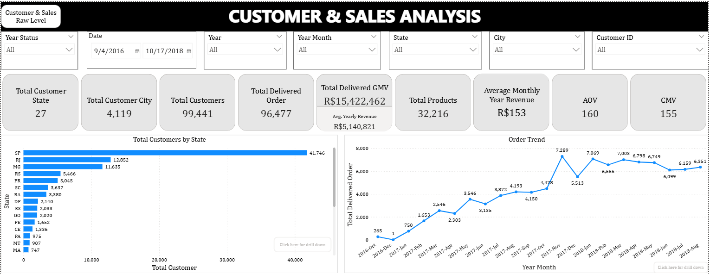
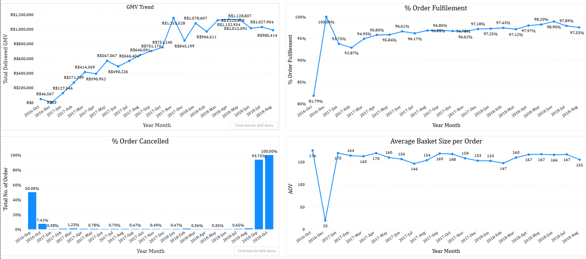
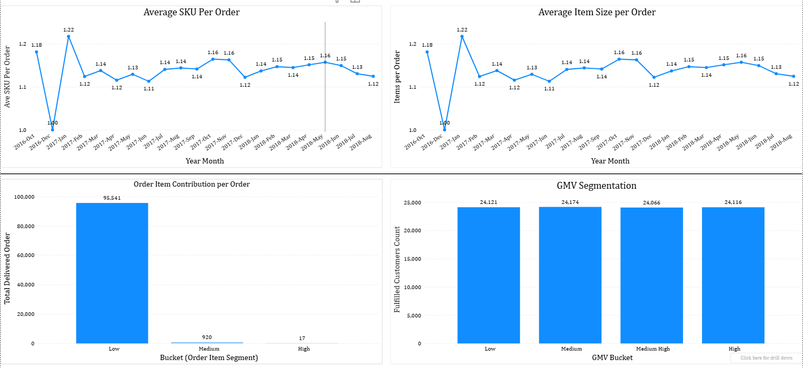
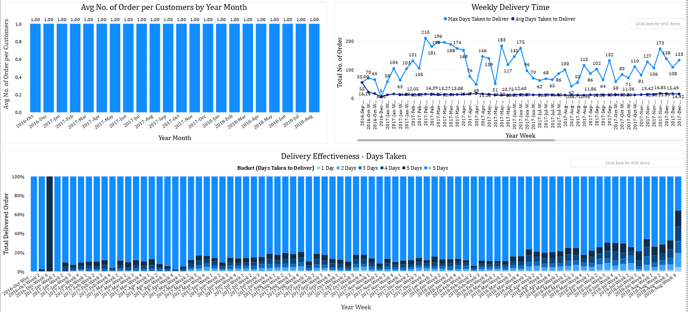

# Olist E-Commerce Analytics Project 🛒📊


## 📌 Project Overview
This project analyzes Olist's Brazilian e-commerce dataset to derive actionable insights for improving sales performance. The analysis covers:
- Customer behavior patterns
- Payment method effectiveness
- Product performance metrics
- Seller/logistics efficiency
- Customer satisfaction trends

🔗 **Repository Link:** [https://github.com/nchibuzo74/SQL_File_Olist_Project](https://github.com/nchibuzo74/SQL_File_Olist_Project)

## 🛠️ Technical Implementation
- **Database:** PostgreSQL (RDBMS)
- **Tools Used:**
  - PG Admin for database management
  - VS Code for SQL development
  - Power BI for dashboard visualization
  - GitHub for version control

## 📂 Repository Structure
SQL_File_Olist_Project/
├── Olist.sql # Main SQL script with all queries
├── Data Dictionary.doc # Comprehensive data documentation
├── .vscode/ # VS Code configuration
├── .gitignore # Version control exclusions
└── README.md # Project documentation


## 🔍 Key Analysis Areas

### 📈 Sales & Customer Insights
```sql
-- Example Query: Total Delivered Revenue
SELECT 
    EXTRACT(YEAR FROM order_purchase_timestamp) AS year,
    SUM(price) AS total_revenue,
    AVG(SUM(price)) OVER () AS avg_yearly_revenue
FROM orders
JOIN order_items USING(order_id)
WHERE order_status = 'delivered'
GROUP BY 1;

- Customer geographic distribution
- Order fulfillment rates
- Revenue trends (AOV, GMV, CMV)
- Customer lifetime value analysis

💳 Payment Analysis
Payment type preferences

Transaction volume trends

Installment payment impact

Payment method segmentation

📦 Product Performance
-- Top Performing Products
SELECT 
    product_id,
    SUM(price) AS total_gmv
FROM order_items
WHERE order_id IN (
    SELECT order_id FROM orders WHERE order_status = 'delivered'
)
GROUP BY 1
ORDER BY 2 DESC
LIMIT 10;

- Product category performance
- GMV growth/decline trends
- Product return analysis
- SKU efficiency metrics

🚚 Seller & Logistics
- Seller performance by region
- Delivery time optimization
- Order fulfillment efficiency
- Seller rating distribution

⭐ Review Analysis
- CSAT score calculation
- Sentiment analysis
- Rating trends over time
- Customer satisfaction by region

📊 Power BI Dashboard
A comprehensive dashboard was developed to visualize:

- Sales performance metrics
- Geographic distribution maps
- Time-series trend analysis
- Customer/seller segmentation

Images on Customer and Sales





🚀 Getting Started
1. Database Setup:
psql -U username -d olist -f Olist.sql

2. Data Exploration:
-- View available tables
SELECT table_name 
FROM information_schema.tables
WHERE table_schema = 'public';

3. Connect Power BI:
- Use PostgreSQL connector
- Import the tables for visualization


📚 Resources
- Olist Dataset Documentation
- PostgreSQL Documentation
- Power BI Documentation

✉️ Contact
For questions or collaboration:

GitHub: nchibuzo74

Email: [nwankwochibuzosamuel24@gmail.com]

